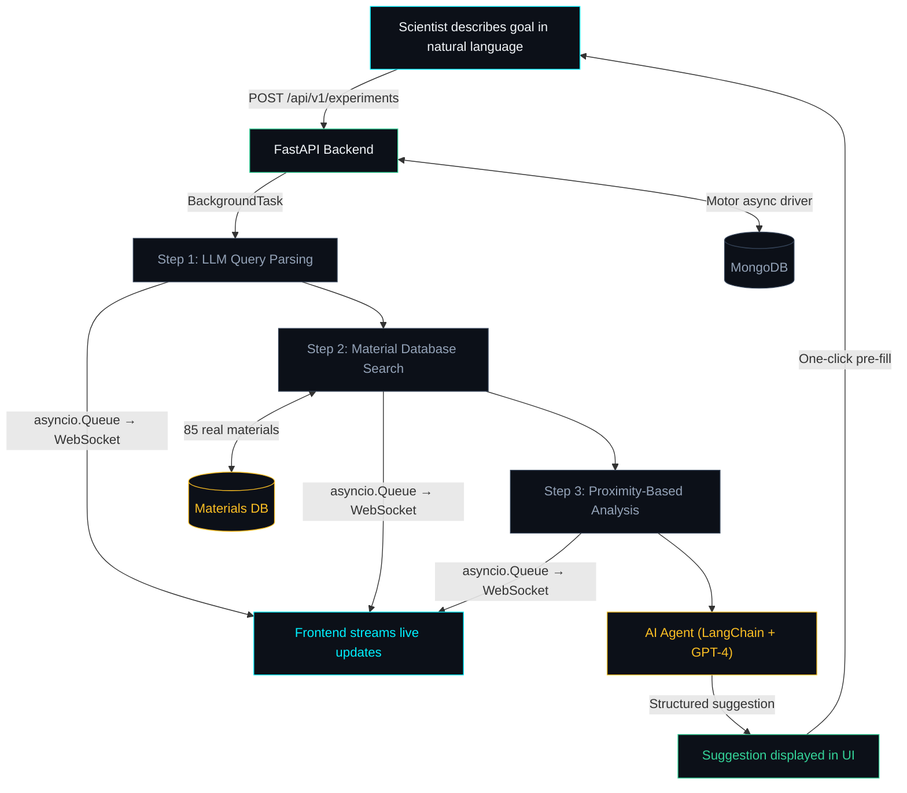

# LoopLab

A closed-loop AI experiment platform for materials science. Define a materials goal in natural language, search a real database of 85 scientifically verified materials, and get AI-powered suggestions for refining your search — all in one dashboard.

---

## Why LoopLab?

Materials discovery is iterative. A scientist picks parameters, runs a simulation, analyzes results, and then decides what to change for the next run. This loop is slow, manual, and error-prone.

LoopLab automates the feedback loop. Instead of switching between tools, spreadsheets, and notebooks, the scientist describes what they need in plain language (e.g. *"Find me a catalyst for nitric acid"* or *"I need a material with thermal conductivity around 1 W/mK"*), and the system searches a real materials database, ranks candidates by how closely they match the request, and suggests how to refine the search next. One click pre-fills the next run with those suggested parameters, closing the loop in seconds instead of hours.

---

## How It Works



### The Loop

1. **Scientist fills a form** — describes a materials goal in natural language, adds input parameters (temperature, pressure, concentration), and constraints (cost limits, safety requirements).
2. **LLM parses the goal** — GPT-4 extracts structured search criteria: target properties with direction (closest/above/below/maximize/minimize), material categories, application keywords, toxicity constraints.
3. **Backend searches the real materials database** — 85 scientifically verified materials are filtered by constraints and ranked by proximity to the user's targets. Not highest — closest.
4. **Analysis selects the best match** — candidates are scored and the best match is presented with its real properties, formula, category, and a contextual recommendation.
5. **AI agent suggests how to refine the search** — a LangChain agent analyzes the real results and suggests parameter changes for the next iteration.
6. **Scientist clicks "Run next iteration"** — the modal pre-fills with the AI's suggested parameters. Tweak if needed, hit start, and the loop begins again.

---

## Materials Database

LoopLab uses a curated database of **85 real materials** with properties sourced from standard reference data (ASM International, MatWeb, CRC Handbook of Chemistry and Physics).

### Categories
| Category | Count | Examples |
|----------|-------|---------|
| Metals & Alloys | 15 | Copper (398 W/mK), Ti-6Al-4V, Inconel 718, Stainless Steel 316L |
| Ceramics | 12 | Silicon Carbide, Alumina, Zirconia (YSZ), Boron Nitride |
| Polymers | 10 | PEEK, PTFE, Polyimide (Kapton), Nylon 6,6, Polycarbonate |
| Composites | 7 | CFRP, Al/SiC MMC, Copper-Graphite, BN-filled Epoxy |
| Catalysts | 10 | Pt-Rh Gauze (Ostwald process), Pd/C, V2O5, Zeolite ZSM-5 |
| Semiconductors | 4 | Silicon, GaAs, GaN, Germanium |
| Battery Materials | 4 | LiFePO4, NMC, LLZO Solid Electrolyte |
| Insulators | 3 | Silica Aerogel (0.015 W/mK), Mineral Wool, PU Foam |
| Other | 20 | Nanomaterials (Graphene, CNTs), Construction, Specialty |

### Properties Per Material
- Thermal conductivity (W/mK)
- Density (g/cm³)
- Melting point (°C)
- Specific heat (J/kg·K)
- Tensile strength (MPa)
- Electrical conductivity (S/m)
- Cost per kg ($)
- Stability score (0–1)
- Toxicity flag
- Real-world applications list

---

## Pipeline Steps

| Step | What It Does |
|------|-------------|
| **Query Parsing** | LLM parses the natural language goal into structured search criteria — target properties, categories, application keywords, constraints |
| **Material Search** | Searches 85-material database, applies hard filters (toxicity, cost, category), ranks by proximity to target values using Gaussian decay scoring |
| **Analysis** | Selects best candidate by match score, builds contextual recommendation explaining why it matches, identifies runner-up |

After all steps complete, the AI service generates a structured suggestion with reasoning, parameter changes, predicted improvement, confidence score, and scientific rationale.

### Search & Ranking Logic

The ranking engine uses **proximity-based scoring**, not naive max/min:

- **"Around 1 W/mK"** → returns materials closest to 1.0 (Concrete at 1.0, Soda-Lime Glass at 1.0, LiFePO4 at 1.1) — not the highest available
- **"Catalyst for nitric acid"** → returns Platinum-Rhodium Gauze (the real Ostwald process catalyst), Rhodium on Alumina, Vanadium Pentoxide
- **"Low cost, non-toxic insulator"** → filters out toxic materials, applies cost constraint, ranks by proximity to target properties

Scoring uses Gaussian decay relative to target magnitude — a 10% deviation scores the same whether the target is 1 W/mK or 1000 W/mK. Multi-criteria queries combine weighted scores for each property target plus application keyword matching.

---

## Where AI Is Used vs Where Code Is Used

| Task | Handled By | Why |
|------|-----------|-----|
| Understanding user intent from natural language | **LLM (GPT-4)** | Unstructured text parsing is what LLMs excel at |
| Filtering materials by numeric criteria | **Deterministic code** | Precise numerical operations must be exact and reproducible |
| Ranking materials by proximity to target | **Deterministic code** | Mathematical scoring must be consistent across runs |
| Generating next-iteration suggestions | **LLM (GPT-4)** | Open-ended scientific reasoning benefits from AI |
| Storing material properties | **Curated database** | Factual data must be verified, consistent, and queryable |

> For a deeper discussion of the architecture and design rationale, see **[ARCHITECTURE.md](./ARCHITECTURE.md)**.

---

## Tech Stack

| Layer | Technology | Why |
|-------|-----------|-----|
| Backend | FastAPI (fully async) | Native async/await, WebSocket support, automatic OpenAPI docs |
| Database | MongoDB via Motor | Flexible document schema fits experiment data naturally, Motor provides async access |
| Materials DB | Python module (85 materials) | Curated, version-controlled, no external DB dependency |
| Real-time | asyncio.Queue + WebSocket | In-process event bus — no Redis or external broker needed for this scale |
| Async jobs | FastAPI BackgroundTasks | Lightweight, no Celery/worker overhead for a single-server deployment |
| AI — Query Parsing | LangChain + GPT-4 | Structured output parsing via PydanticOutputParser with keyword-based fallback |
| AI — Suggestions | LangChain + GPT-4 | Structured scientific reasoning over real material data |
| Frontend | React + Vite | Fast HMR, simple SPA setup |
| Styling | Tailwind CSS | Utility-first, dark theme, no component library overhead |
| Routing | React Router | Client-side routing between Dashboard and ExperimentView |

---

## Project Structure

```
looplab/
├── backend/
│   ├── app/
│   │   ├── main.py                  # FastAPI app, CORS, lifespan
│   │   ├── config.py                # Pydantic settings (env-based)
│   │   ├── database.py              # Motor client connect/close
│   │   ├── data/
│   │   │   └── materials.py         # 85 real materials with verified properties
│   │   ├── models/
│   │   │   ├── experiment.py        # ExperimentCreate, StepResult, ExperimentDoc
│   │   │   └── suggestion.py        # AISuggestion, ParameterChange
│   │   ├── routers/
│   │   │   ├── experiments.py       # CRUD endpoints
│   │   │   ├── health.py            # Health check endpoint
│   │   │   └── ws.py               # WebSocket streaming
│   │   ├── services/
│   │   │   ├── pipeline.py          # 3-step async pipeline (parse → search → analyze)
│   │   │   ├── query_parser.py      # LLM-powered natural language query parsing
│   │   │   ├── material_search.py   # Proximity-based search & ranking engine
│   │   │   └── ai_service.py        # LangChain suggestion generator
│   │   └── utils/
│   │       └── events.py            # asyncio.Queue event bus
│   ├── requirements.txt
│   ├── .env.example
│   └── .env
├── frontend/
│   ├── src/
│   │   ├── main.jsx                 # React entry, BrowserRouter
│   │   ├── App.jsx                  # Route definitions
│   │   ├── api/
│   │   │   └── experiments.js       # Axios calls to backend
│   │   ├── hooks/
│   │   │   └── useExperimentStream.js  # WebSocket hook
│   │   ├── components/
│   │   │   ├── StreamingText.jsx    # Typewriter text effect
│   │   │   └── ExportResults.jsx    # JSON/CSV export
│   │   └── pages/
│   │       ├── Dashboard.jsx        # Experiment list + create modal
│   │       └── ExperimentView.jsx   # Live pipeline + results + AI suggestion
│   ├── index.html
│   ├── vite.config.js               # Proxy config for /api and /ws
│   └── package.json
├── ARCHITECTURE.md                   # Design decisions and AI rationale
└── README.md
```

---

## API Reference

### REST Endpoints

| Method | Path | Description |
|--------|------|-------------|
| `POST` | `/api/v1/experiments` | Create a new experiment. Returns `experiment_id` and `ws_url`. Fires pipeline in background. |
| `GET` | `/api/v1/experiments` | List all experiments (sorted by newest first). Supports `?skip=0&limit=20`. |
| `GET` | `/api/v1/experiments/{id}` | Get a single experiment with full step data, results, and AI suggestion. |
| `DELETE` | `/api/v1/experiments/{id}` | Delete an experiment. |

### WebSocket

| Path | Description |
|------|-------------|
| `ws://localhost:8000/ws/experiments/{id}/stream` | Live event stream for an experiment. Sends catch-up events on connect, then streams step_started, step_completed, experiment_completed, ai_suggestion_ready, or failed events. |

### Event Schema

Every WebSocket message follows this shape:

```json
{
  "event": "step_started | step_completed | experiment_completed | ai_suggestion_ready | failed",
  "experiment_id": "uuid",
  "step_name": "Parameter Validation | Simulation | Analysis | null",
  "progress": 0-100,
  "data": {},
  "timestamp": "ISO 8601"
}
```

---

## Data Models

### ExperimentCreate (request body)
```json
{
  "goal": "Find me a catalyst for nitric acid production",
  "parameters": { "temperature": 220.0, "pressure": 1.5 },
  "constraints": ["cost_per_kg < 80", "non_toxic = true"]
}
```

### Simulation Step Output (real material candidates)
```json
{
  "candidates": [
    {
      "id": "MAT-071",
      "name": "Platinum-Rhodium Gauze",
      "formula": "Pt-Rh (90/10)",
      "category": "catalyst",
      "thermal_conductivity": 50.0,
      "density": 19.0,
      "melting_point": 1800,
      "stability_score": 0.94,
      "cost_per_kg": 95000.0,
      "match_score": 0.99,
      "applications": ["nitric acid production", "ammonia oxidation (Ostwald process)"]
    }
  ],
  "total_searched": 85,
  "filters_applied": { "categories": ["catalyst"], "exclude_toxic": false, "max_cost": null }
}
```

### AISuggestion (returned after pipeline completes)
```json
{
  "reasoning": "Step-by-step analysis of results...",
  "suggested_parameters": [
    {
      "name": "temperature",
      "current_value": 220.0,
      "suggested_value": 245.0,
      "change_direction": "increase",
      "expected_impact": "Higher temperature favors ammonia oxidation kinetics on Pt-Rh"
    }
  ],
  "predicted_improvement_pct": 12.0,
  "confidence": 0.82,
  "scientific_rationale": "The Ostwald process operates optimally at 800-900°C..."
}
```

---

## Local Setup (Step by Step)

### Prerequisites

Make sure these are installed on your machine before proceeding:

| Tool | Minimum Version | Check with |
|------|----------------|------------|
| Python | 3.11+ | `python3 --version` |
| Node.js | 18+ | `node --version` |
| npm | 9+ | `npm --version` |
| MongoDB | 7+ | `mongosh --eval "db.version()"` |

> **MongoDB**: If not installed, use `brew install mongodb-community` on macOS or follow the [MongoDB install guide](https://www.mongodb.com/docs/manual/installation/) for your OS. Make sure the `mongod` service is running before starting the backend.

### Step 1 — Clone & Navigate

```bash
cd looplab
```

### Step 2 — Backend Setup

```bash
cd backend

# Create a Python virtual environment
python3 -m venv venv

# Activate it
source venv/bin/activate        # macOS / Linux
# venv\Scripts\activate          # Windows PowerShell

# Install dependencies
pip install -r requirements.txt

# Create your environment file
cp .env.example .env
```

Edit `backend/.env` and configure:

```env
MONGODB_URL=mongodb://localhost:27017
MONGODB_DB_NAME=looplab
OPENAI_API_KEY=your_key_here    # Optional — app works without it (uses fallback)
```

> **No OpenAI key?** No problem. The pipeline uses a keyword-based fallback query parser and the AI suggestion card shows a fallback with `confidence: 0%`. Add a key later anytime to enable LLM-powered query parsing and AI suggestions.

### Step 3 — Start the Backend

```bash
# Make sure you're in looplab/backend with venv activated
python -m uvicorn app.main:app --host 0.0.0.0 --port 8000
```

You should see:

```
INFO:     Uvicorn running on http://0.0.0.0:8000 (Press CTRL+C to quit)
```

Verify it's working:

```bash
# In a separate terminal
curl http://localhost:8000/api/v1/experiments
# Should return: []
```

### Step 4 — Frontend Setup

Open a **new terminal** (keep the backend running):

```bash
cd looplab/frontend

# Install dependencies
npm install

# Start the dev server
npm run dev
```

You should see:

```
VITE v8.x.x  ready in XXX ms

  ➜  Local:   http://localhost:5173/
```

### Step 5 — Open the App

Go to **http://localhost:5173** in your browser. You should see the LoopLab dashboard.

### Summary of Running Services

| Service | URL | Terminal |
|---------|-----|---------|
| Backend API | http://localhost:8000 | Terminal 1 |
| API Docs (Swagger) | http://localhost:8000/docs | (same backend) |
| Frontend | http://localhost:5173 | Terminal 2 |
| MongoDB | mongodb://localhost:27017 | Background service |

### Stopping Everything

```bash
# In each terminal, press Ctrl+C to stop the server
# Or kill by port:
kill $(lsof -ti:8000)   # backend
kill $(lsof -ti:5173)   # frontend
```

---

## Design Decisions

### Why a curated materials database over LLM-generated data?

LLMs know *about* materials from training data, but they can't reliably look up exact property values on demand. They hallucinate numbers. A query like "filter materials with thermal conductivity between 0.8 and 1.2 W/mK" is a database operation — precise numerical filtering and sorting must be deterministic. The LLM parses the intent; the database provides the facts.

### Why proximity-based ranking over simple max/min?

If a user asks for "thermal conductivity around 1 W/mK", they want the closest match — not the highest available. The previous approach used `max()` which always returned the highest value regardless of the query. The new scoring uses Gaussian decay relative to the target value, so "around 1" returns materials at 1.0, 1.1, 1.14 — not 3000 (graphene).

### Why BackgroundTasks over Celery?
LoopLab runs on a single server. Celery adds Redis/RabbitMQ as a broker, a separate worker process, and serialization overhead. FastAPI's `BackgroundTasks` keeps the pipeline in the same process with zero infrastructure cost. For a single-server deployment, this is the right trade-off.

### Why asyncio.Queue over Redis Pub/Sub?
The event bus only needs to deliver events from a background task to a WebSocket connection within the same process. An in-memory `asyncio.Queue` does this with zero latency and zero external dependencies. Redis would be needed if we scaled to multiple backend instances, but that's not the current requirement.

### Why MongoDB over PostgreSQL?
Experiment documents have nested, variable-shape data — steps with different outputs, AI suggestions with dynamic parameter lists, simulation candidates. MongoDB's document model fits this naturally without requiring migrations or JSON columns. Motor provides first-class async access.

### Why Tailwind over a component library?
The UI is two pages with straightforward layouts. A component library (MUI, Chakra) would add bundle size and opinionated styling for components we don't need. Tailwind gives full control over the dark-themed, minimal design without fighting a library's defaults.

### Why WebSocket over Server-Sent Events?
WebSocket gives bidirectional communication if needed later (e.g. cancelling a running pipeline). FastAPI has native WebSocket support. The implementation includes catch-up events on reconnect, so clients that connect mid-pipeline don't miss anything.

---

## How to Use It

### 1. Create Your First Experiment

- Open `http://localhost:5173` in your browser
- Click the **+ NEW RUN** button in the top-right corner
- Fill out the form:
  - **Objective**: Describe what you're looking for in natural language, e.g.:
    - *"Find me a catalyst for nitric acid production"*
    - *"I need a material with thermal conductivity around 1 W/mK"*
    - *"Low-cost non-toxic polymer for EV battery thermal management"*
  - **Parameters**: Add key-value pairs for target properties. Click **ADD PARAMETER** for more. Examples:
    - `thermal_conductivity` = `1.0`
    - `temperature` = `220`
  - **Constraints** (optional): Comma-separated conditions like `cost_per_kg < 80, non_toxic = true`
- Click **LAUNCH EXPERIMENT**

### 2. Watch the Pipeline Run Live

You'll be redirected to the experiment view. Watch in real time as each step progresses:

1. **Parameter Validation** — LLM parses your goal into structured criteria (target properties, categories, application keywords). Shows parsed query tags.
2. **Material Search** — searches 85 real materials, applies filters, returns top 5 ranked by match score. Each candidate shows name, formula, properties, and match percentage.
3. **Analysis** — selects the best candidate with contextual recommendation explaining why it matches your request.

Each step shows a shimmer progress bar while running and reveals its output when complete.

### 3. Review the Results

The **Result** card shows the best matching material with:
- Material name, formula, and category
- Key properties: thermal conductivity, density, stability score, cost
- Melting point and runner-up alternative
- Match score (how closely it matches your request)
- Contextual recommendation

### 4. Review the AI Suggestion

After the pipeline finishes, the AI Suggestion card appears with:
- **Reasoning** — streams in with a typewriter effect explaining the AI's thought process
- **Suggested parameter changes** — each parameter listed with current value, suggested value, and direction (UP/DOWN/HOLD)
- **Expected improvement %** and **Confidence score** with a visual bar
- **Scientific rationale** — expandable section with detailed justification

### 5. Run the Next Iteration

Click **RUN NEXT ITERATION** at the bottom of the suggestion card. This takes you back to the dashboard with a pre-filled modal containing the AI's suggested parameters. Tweak anything you want, then launch again. This is the closed loop — each run builds on the last.

### 6. Export Results

Completed experiments can be exported as **JSON** or **CSV** using the buttons in the experiment header. Exports include all candidates, properties, match scores, and AI suggestions.

---

## Example Queries

| Query | What the System Returns |
|-------|------------------------|
| *"Find me a catalyst for nitric acid"* | Platinum-Rhodium Gauze (Pt-Rh 90/10) — the actual Ostwald process catalyst |
| *"Material with thermal conductivity around 1 W/mK"* | Concrete (1.0), Soda-Lime Glass (1.0), LiFePO4 (1.1) — closest matches, not highest |
| *"High thermal conductivity metal for heat exchangers"* | Silver (429), Copper (398), Gold (317) — filtered to metals, ranked by TC |
| *"Low-cost non-toxic insulator"* | Mineral Wool ($1/kg), Polyurethane Foam ($4/kg), Calcium Silicate ($3/kg) |
| *"Battery cathode material under $30/kg"* | LiFePO4 ($12/kg), NMC ($25/kg) — cost-filtered, category-matched |

---

## Testing It End-to-End

### Quick Smoke Test (no OpenAI key needed)

The app works fully without an OpenAI key — query parsing falls back to keyword-based extraction, and the AI suggestion falls back gracefully with `confidence: 0%`.

```bash
# 1. Make sure MongoDB is running
mongosh --eval "db.adminCommand('ping')"

# 2. Start the backend
cd looplab/backend
python3 -m venv venv
source venv/bin/activate
cp .env.example .env
pip install -r requirements.txt
python -m uvicorn app.main:app --host 0.0.0.0 --port 8000

# 3. Start the frontend (separate terminal)
cd looplab/frontend
npm install
npm run dev

# 4. Open http://localhost:5173 and create an experiment
```

### Test via cURL (backend only)

```bash
# Create an experiment
curl -s -X POST http://localhost:8000/api/v1/experiments \
  -H "Content-Type: application/json" \
  -d '{
    "goal": "Find me a catalyst for nitric acid production",
    "parameters": {"temperature": 220},
    "constraints": ["cost_per_kg < 100000"]
  }' | python3 -m json.tool

# Response includes experiment_id and ws_url
# Wait ~3 seconds for the pipeline to complete, then:

# Get the completed experiment
curl -s http://localhost:8000/api/v1/experiments/{EXPERIMENT_ID} | python3 -m json.tool

# List all experiments
curl -s http://localhost:8000/api/v1/experiments | python3 -m json.tool

# Delete an experiment
curl -s -X DELETE http://localhost:8000/api/v1/experiments/{EXPERIMENT_ID}
```

### Test WebSocket Streaming

```bash
# Using websocat (install: brew install websocat)
# First create an experiment via cURL, then immediately connect:
websocat ws://localhost:8000/ws/experiments/{EXPERIMENT_ID}/stream

# You'll see JSON events streaming in real time:
# {"event": "step_started", "step_name": "Parameter Validation", ...}
# {"event": "step_completed", "step_name": "Parameter Validation", ...}
# {"event": "step_started", "step_name": "Simulation", ...}
# ... and so on until "ai_suggestion_ready"
```

### Interactive API Docs

FastAPI auto-generates interactive API documentation:
- **Swagger UI**: `http://localhost:8000/docs` — try endpoints directly in the browser
- **ReDoc**: `http://localhost:8000/redoc` — cleaner read-only documentation

### What to Look For

| Check | Expected |
|-------|----------|
| Dashboard loads | Shows "No experiments yet" or list of past runs |
| Create experiment | Redirects to experiment view, pipeline starts streaming |
| Step 1 completes | Green dot, "VALID" badge, parsed query tags shown |
| Step 2 completes | Top 5 real materials listed with names, formulas, match scores |
| Step 3 completes | Best candidate highlighted with contextual recommendation |
| Result card | Shows material name, formula, category, multiple properties, match score |
| AI Suggestion card | Reasoning streams in, parameter changes listed, confidence bar fills |
| "Run next iteration" | Returns to dashboard, modal opens pre-filled with suggested params |
| "thermal conductivity around 1 W/mK" | Returns materials near 1.0, **not** the highest available |
| "catalyst for nitric acid" | Returns Pt-Rh Gauze, Rh/Al2O3, V2O5 — real industrial catalysts |
| No OpenAI key | Query parsing uses keyword fallback, AI suggestion shows confidence 0% |

---

## What Happens Without an OpenAI Key?

Without a key, two things change:

1. **Query parsing** falls back to a keyword-based parser. It still extracts material categories, property targets from parameter names, and application keywords from the goal text — but it's less sophisticated than the LLM parser.
2. **AI suggestions** return a fallback response with `confidence: 0.0` and all parameters set to "maintain".

Everything else works identically — the materials database, search, ranking, and UI are fully functional. Add a key to `.env` anytime to enable LLM-powered features.
