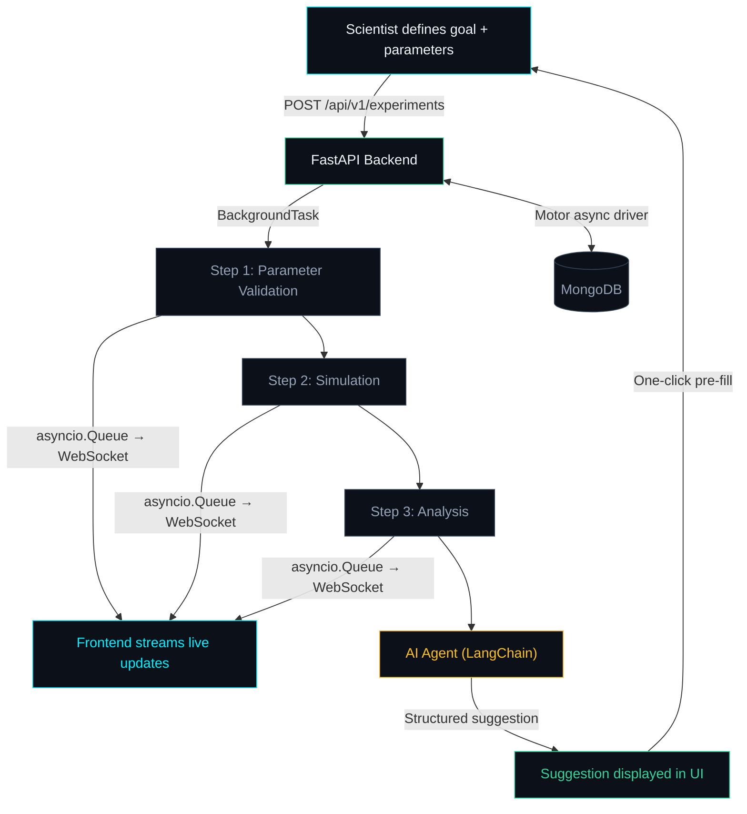

# LoopLab

A closed-loop AI experiment platform for materials science. Define a materials goal, watch the pipeline run live, and get an AI-powered suggestion for your next iteration — all in one dashboard.

---

## Why LoopLab?

Materials discovery is iterative. A scientist picks parameters, runs a simulation, analyzes results, and then decides what to change for the next run. This loop is slow, manual, and error-prone.

LoopLab automates the feedback loop. Instead of switching between tools, spreadsheets, and notebooks, the scientist sees every step of the pipeline stream in real time and immediately receives an AI suggestion for what to try next. One click pre-fills the next run with those suggested parameters, closing the loop in seconds instead of hours.

This is the core workflow behind any materials informatics platform — parameter exploration, simulation, analysis, and AI-guided iteration — built lean and clean as a single full-stack application.

---

## How It Works



### The Loop

1. **Scientist fills a form** — defines a materials goal, input parameters (temperature, pressure, concentration), and constraints (cost limits, safety requirements).
2. **Backend kicks off a 3-step async pipeline** — the API returns immediately and fires the pipeline as a background task. No blocking, no polling.
3. **Frontend streams each step live via WebSocket** — the dashboard updates in real time as each step starts, runs, and completes. No page refresh needed.
4. **AI agent suggests the next best parameter change** — after the pipeline finishes, a LangChain agent analyzes the results and returns a structured suggestion: which parameter to change, by how much, expected improvement, and scientific rationale.
5. **Scientist clicks "Run next iteration"** — the modal pre-fills with the AI's suggested parameters. Tweak if needed, hit start, and the loop begins again.

---

## Pipeline Steps

| Step | Duration | What It Does |
|------|----------|--------------|
| Parameter Validation | ~1.5s | Validates input parameters, flags warnings (e.g. temperature near safety limits) |
| Simulation | ~3s | Generates 3 material candidates with thermal conductivity, stability scores, and cost estimates |
| Analysis | ~1s | Picks the best candidate, calculates improvement over baseline, produces a recommendation |

After all steps complete, the AI service generates a structured suggestion with reasoning, parameter changes, predicted improvement percentage, confidence score, and scientific rationale.

---

## Tech Stack

| Layer | Technology | Why |
|-------|-----------|-----|
| Backend | FastAPI (fully async) | Native async/await, WebSocket support, automatic OpenAPI docs |
| Database | MongoDB via Motor | Flexible document schema fits experiment data naturally, Motor provides async access |
| Real-time | asyncio.Queue + WebSocket | In-process event bus — no Redis or external broker needed for this scale |
| Async jobs | FastAPI BackgroundTasks | Lightweight, no Celery/worker overhead for a single-server deployment |
| AI | LangChain + GPT-4o-mini | Structured output parsing via PydanticOutputParser, graceful fallback on failure |
| Frontend | React + Vite | Fast HMR, simple SPA setup |
| Styling | Tailwind CSS | Utility-first, dark theme, no component library overhead |
| Routing | React Router | Client-side routing between Dashboard and ExperimentView |

---

## Project Structure

```
looplab/
├── backend/
│   ├── app/
│   │   ├── main.py                  # FastAPI app, CORS, lifespan
│   │   ├── config.py                # Pydantic settings (env-based)
│   │   ├── database.py              # Motor client connect/close
│   │   ├── models/
│   │   │   ├── experiment.py        # ExperimentCreate, StepResult, ExperimentDoc
│   │   │   └── suggestion.py        # AISuggestion, ParameterChange
│   │   ├── routers/
│   │   │   ├── experiments.py       # CRUD endpoints
│   │   │   └── ws.py               # WebSocket streaming
│   │   ├── services/
│   │   │   ├── pipeline.py          # 3-step async pipeline
│   │   │   └── ai_service.py        # LangChain suggestion generator
│   │   └── utils/
│   │       └── events.py            # asyncio.Queue event bus
│   ├── requirements.txt
│   ├── .env.example
│   └── .env
├── frontend/
│   ├── src/
│   │   ├── main.jsx                 # React entry, BrowserRouter
│   │   ├── App.jsx                  # Route definitions
│   │   ├── api/
│   │   │   └── experiments.js       # Axios calls to backend
│   │   ├── hooks/
│   │   │   └── useExperimentStream.js  # WebSocket hook
│   │   └── pages/
│   │       ├── Dashboard.jsx        # Experiment list + create modal
│   │       └── ExperimentView.jsx   # Live pipeline + results + AI suggestion
│   ├── index.html
│   ├── vite.config.js               # Proxy config for /api and /ws
│   └── package.json
├── plan.md
└── README.md
```

---

## API Reference

### REST Endpoints

| Method | Path | Description |
|--------|------|-------------|
| `POST` | `/api/v1/experiments` | Create a new experiment. Returns `experiment_id` and `ws_url`. Fires pipeline in background. |
| `GET` | `/api/v1/experiments` | List all experiments (sorted by newest first). Supports `?skip=0&limit=20`. |
| `GET` | `/api/v1/experiments/{id}` | Get a single experiment with full step data, results, and AI suggestion. |
| `DELETE` | `/api/v1/experiments/{id}` | Delete an experiment. |

### WebSocket

| Path | Description |
|------|-------------|
| `ws://localhost:8000/ws/experiments/{id}/stream` | Live event stream for an experiment. Sends catch-up events on connect, then streams step_started, step_completed, experiment_completed, ai_suggestion_ready, or failed events. |

### Event Schema

Every WebSocket message follows this shape:

```json
{
  "event": "step_started | step_completed | experiment_completed | ai_suggestion_ready | failed",
  "experiment_id": "uuid",
  "step_name": "Parameter Validation | Simulation | Analysis | null",
  "progress": 0-100,
  "data": {},
  "timestamp": "ISO 8601"
}
```

---

## Data Models

### ExperimentCreate (request body)
```json
{
  "goal": "Maximize thermal conductivity for EV battery polymer",
  "parameters": { "temperature": 220.0, "pressure": 1.5, "concentration": 0.35 },
  "constraints": ["cost_per_kg < 80", "non_toxic = true"]
}
```

### AISuggestion (returned after pipeline completes)
```json
{
  "reasoning": "Step-by-step analysis of results...",
  "suggested_parameters": [
    {
      "name": "temperature",
      "current_value": 220.0,
      "suggested_value": 245.0,
      "change_direction": "increase",
      "expected_impact": "10-15% conductivity gain based on polymer blend behavior"
    }
  ],
  "predicted_improvement_pct": 12.0,
  "confidence": 0.82,
  "scientific_rationale": "Simulation data shows conductivity plateau beginning at 220C..."
}
```

---

## Local Setup (Step by Step)

### Prerequisites

Make sure these are installed on your machine before proceeding:

| Tool | Minimum Version | Check with |
|------|----------------|------------|
| Python | 3.11+ | `python3 --version` |
| Node.js | 18+ | `node --version` |
| npm | 9+ | `npm --version` |
| MongoDB | 7+ | `mongosh --eval "db.version()"` |

> **MongoDB**: If not installed, use `brew install mongodb-community` on macOS or follow the [MongoDB install guide](https://www.mongodb.com/docs/manual/installation/) for your OS. Make sure the `mongod` service is running before starting the backend.

### Step 1 — Clone & Navigate

```bash
cd looplab
```

### Step 2 — Backend Setup

```bash
cd backend

# Create a Python virtual environment
python3 -m venv venv

# Activate it
source venv/bin/activate        # macOS / Linux
# venv\Scripts\activate          # Windows PowerShell

# Install dependencies
pip install -r requirements.txt

# Create your environment file
cp .env.example .env
```

Edit `backend/.env` and configure:

```env
MONGODB_URL=mongodb://localhost:27017
MONGODB_DB_NAME=looplab
OPENAI_API_KEY=your_key_here    # Optional — app works without it (uses fallback)
```

> **No OpenAI key?** No problem. The pipeline and UI work fully. The AI suggestion card will show a fallback with `confidence: 0%` and all parameters set to "maintain". Add a key later anytime.

### Step 3 — Start the Backend

```bash
# Make sure you're in looplab/backend with venv activated
python -m uvicorn app.main:app --host 0.0.0.0 --port 8000
```

You should see:

```
INFO:     Uvicorn running on http://0.0.0.0:8000 (Press CTRL+C to quit)
```

Verify it's working:

```bash
# In a separate terminal
curl http://localhost:8000/api/v1/experiments
# Should return: []
```

### Step 4 — Frontend Setup

Open a **new terminal** (keep the backend running):

```bash
cd looplab/frontend

# Install dependencies
npm install

# Start the dev server
npm run dev
```

You should see:

```
VITE v8.x.x  ready in XXX ms

  ➜  Local:   http://localhost:5173/
```

### Step 5 — Open the App

Go to **http://localhost:5173** in your browser. You should see the LoopLab dashboard.

### Summary of Running Services

| Service | URL | Terminal |
|---------|-----|---------|
| Backend API | http://localhost:8000 | Terminal 1 |
| API Docs (Swagger) | http://localhost:8000/docs | (same backend) |
| Frontend | http://localhost:5173 | Terminal 2 |
| MongoDB | mongodb://localhost:27017 | Background service |

### Stopping Everything

```bash
# In each terminal, press Ctrl+C to stop the server
# Or kill by port:
kill $(lsof -ti:8000)   # backend
kill $(lsof -ti:5173)   # frontend
```

---

## Design Decisions

### Why BackgroundTasks over Celery?
LoopLab runs on a single server. Celery adds Redis/RabbitMQ as a broker, a separate worker process, and serialization overhead. FastAPI's `BackgroundTasks` keeps the pipeline in the same process with zero infrastructure cost. For a single-server deployment, this is the right trade-off.

### Why asyncio.Queue over Redis Pub/Sub?
The event bus only needs to deliver events from a background task to a WebSocket connection within the same process. An in-memory `asyncio.Queue` does this with zero latency and zero external dependencies. Redis would be needed if we scaled to multiple backend instances, but that's not the current requirement.

### Why MongoDB over PostgreSQL?
Experiment documents have nested, variable-shape data — steps with different outputs, AI suggestions with dynamic parameter lists, simulation candidates. MongoDB's document model fits this naturally without requiring migrations or JSON columns. Motor provides first-class async access.

### Why Tailwind over a component library?
The UI is two pages with straightforward layouts. A component library (MUI, Chakra) would add bundle size and opinionated styling for components we don't need. Tailwind gives full control over the dark-themed, minimal design without fighting a library's defaults.

### Why WebSocket over Server-Sent Events?
WebSocket gives bidirectional communication if needed later (e.g. cancelling a running pipeline). FastAPI has native WebSocket support. The implementation includes catch-up events on reconnect, so clients that connect mid-pipeline don't miss anything.

---

## How to Use It

### 1. Create Your First Experiment

- Open `http://localhost:5173` in your browser
- Click the **+ NEW RUN** button in the top-right corner
- Fill out the form:
  - **Objective**: Describe what you're trying to optimize (e.g. "Find polymer with thermal conductivity > 2 W/mK for EV battery application")
  - **Parameters**: Add key-value pairs for your experiment inputs. Click **ADD PARAMETER** for more. Examples:
    - `temperature` = `220`
    - `pressure` = `1.5`
    - `concentration` = `0.35`
  - **Constraints** (optional): Comma-separated conditions like `cost_per_kg < 80, non_toxic = true`
- Click **LAUNCH EXPERIMENT**

### 2. Watch the Pipeline Run Live

You'll be redirected to the experiment view. Watch in real time as each step progresses:

1. **Parameter Validation** (~1.5s) — validates your inputs, flags any warnings
2. **Simulation** (~3s) — generates 3 material candidates with conductivity, stability, and cost data
3. **Analysis** (~1s) — picks the best candidate and calculates improvement

Each step shows a shimmer progress bar while running and reveals its output when complete.

### 3. Review the AI Suggestion

After the pipeline finishes, the AI Suggestion card appears with:
- **Reasoning** — streams in with a typewriter effect explaining the AI's thought process
- **Suggested parameter changes** — each parameter listed with current value, suggested value, and direction (UP/DOWN/HOLD)
- **Expected improvement %** and **Confidence score** with a visual bar
- **Scientific rationale** — expandable section with detailed justification

### 4. Run the Next Iteration

Click **RUN NEXT ITERATION** at the bottom of the suggestion card. This takes you back to the dashboard with a pre-filled modal containing the AI's suggested parameters. Tweak anything you want, then launch again. This is the closed loop — each run builds on the last.

### 5. Manage Experiments

- The **Dashboard** auto-refreshes every 5 seconds to show latest status
- Hover over any experiment card to see the **Delete** button
- Click any card to view its full details and results

---

## Testing It End-to-End

### Test Cases

We provide a set of realistic materials science experiment inputs in **[test-cases.md](./test-cases.md)**. These cover diverse scenarios — EV battery polymers, high-temperature edge cases, multi-parameter sweeps, and more. Copy-paste them into the "New Run" modal to exercise different pipeline behaviors (validation warnings, varied candidate outputs, etc.).

### Quick Smoke Test (no OpenAI key needed)

The app works fully without an OpenAI key — the AI suggestion falls back gracefully with `confidence: 0%` and "maintain" recommendations.

```bash
# 1. Make sure MongoDB is running
mongosh --eval "db.adminCommand('ping')"

# 2. Start the backend
cd looplab/backend
python3 -m venv venv
source venv/bin/activate
cp .env.example .env
pip install -r requirements.txt
python -m uvicorn app.main:app --host 0.0.0.0 --port 8000

# 3. Start the frontend (separate terminal)
cd looplab/frontend
npm install
npm run dev

# 4. Open http://localhost:5173 and create an experiment
```

### Test via cURL (backend only)

```bash
# Create an experiment
curl -s -X POST http://localhost:8000/api/v1/experiments \
  -H "Content-Type: application/json" \
  -d '{
    "goal": "Maximize thermal conductivity for EV battery polymer",
    "parameters": {"temperature": 220, "pressure": 1.5, "concentration": 0.35},
    "constraints": ["cost_per_kg < 80"]
  }' | python3 -m json.tool

# Response includes experiment_id and ws_url
# Wait ~6 seconds for the pipeline to complete, then:

# Get the completed experiment
curl -s http://localhost:8000/api/v1/experiments/{EXPERIMENT_ID} | python3 -m json.tool

# List all experiments
curl -s http://localhost:8000/api/v1/experiments | python3 -m json.tool

# Delete an experiment
curl -s -X DELETE http://localhost:8000/api/v1/experiments/{EXPERIMENT_ID}
```

### Test WebSocket Streaming

```bash
# Using websocat (install: brew install websocat)
# First create an experiment via cURL, then immediately connect:
websocat ws://localhost:8000/ws/experiments/{EXPERIMENT_ID}/stream

# You'll see JSON events streaming in real time:
# {"event": "step_started", "step_name": "Parameter Validation", ...}
# {"event": "step_completed", "step_name": "Parameter Validation", ...}
# {"event": "step_started", "step_name": "Simulation", ...}
# ... and so on until "ai_suggestion_ready"
```

### Test with Real AI Suggestions

```bash
# Add your OpenAI API key to the .env file
echo "OPENAI_API_KEY=sk-your-key-here" >> looplab/backend/.env

# Restart the backend — the AI service will now call GPT-4o-mini
# for real scientific suggestions instead of the fallback
```

### Interactive API Docs

FastAPI auto-generates interactive API documentation:
- **Swagger UI**: `http://localhost:8000/docs` — try endpoints directly in the browser
- **ReDoc**: `http://localhost:8000/redoc` — cleaner read-only documentation

### What to Look For

| Check | Expected |
|-------|----------|
| Dashboard loads | Shows "No experiments yet" or list of past runs |
| Create experiment | Redirects to experiment view, pipeline starts streaming |
| Step 1 completes | Green dot, "VALID" badge, duration shown |
| Step 2 completes | 3 candidates listed with conductivity/stability/cost |
| Step 3 completes | Best candidate highlighted with improvement % |
| Result card | Shows best candidate, conductivity, and improvement metrics |
| AI Suggestion card | Reasoning streams in, parameter changes listed, confidence bar fills |
| "Run next iteration" | Returns to dashboard, modal opens pre-filled with suggested params |
| Reconnect mid-pipeline | Open experiment view after pipeline started — catch-up events replay completed steps |
| No OpenAI key | AI suggestion shows fallback with confidence 0%, all params "HOLD" |

---

## What Happens Without an OpenAI Key?

The AI service falls back gracefully. Instead of a real suggestion, it returns a fallback response with `confidence: 0.0` and all parameters set to "maintain". The rest of the application works identically — pipeline runs, results display, the suggestion card shows the fallback. Add a key to `.env` anytime to enable real suggestions.
